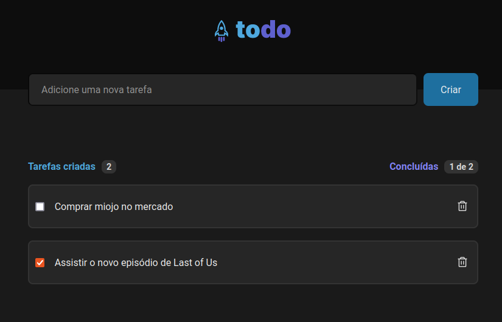

#### TO DO list that you can 

- add a new todo task
- check and uncheck tasks as completed
- remove task from list
- count finished task



#### This frontend app explores
- handling state in React
- list map and React key
- function as a property
- CSS 
#### To install and run this app: 
``` bash
npm install
npm run dev
```

#### This project is using `Vite`:
    - React
    - TypeScript
#### Also using Google Fonts, selected regular 400 and bold 700 added to `index.html`.

#### The UI project is placed in Figma
- Figma: References
#
## References 
- Vite: https://vitejs.dev/
#### Figma Project
- Figma: https://www.figma.com/file/HSMBp9x3SINgp2LmwAxNPM/ToDo-List-(Copy)?node-id=0%3A1&t=FY6c1KksWdiMEXFZ-1

#### References for styling
- Roboto: https://fonts.google.com/specimen/Roboto
- CSS Moludes: https://create-react-app.dev/docs/adding-a-css-modules-stylesheet/
- CSS variables: https://www.w3schools.com/css/css3_variables.asp
- Font-smothing: https://developer.mozilla.org/en-US/docs/Web/CSS/font-smooth
#### References for React 
- React input: https://react.dev/reference/react-dom/components/input#providing-an-initial-value-for-an-input
